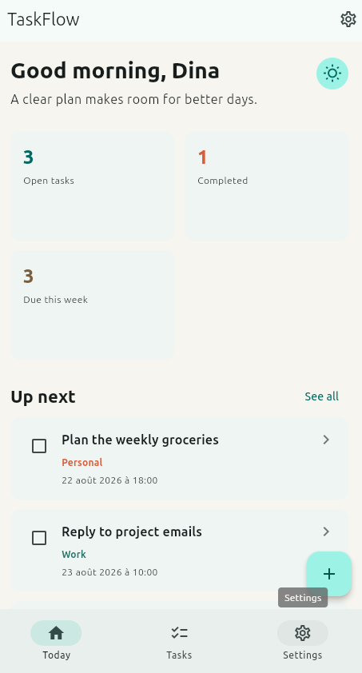
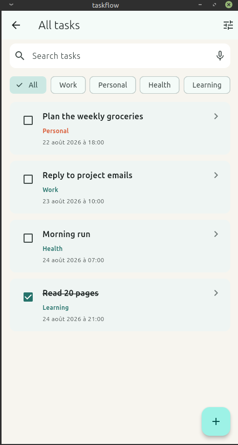
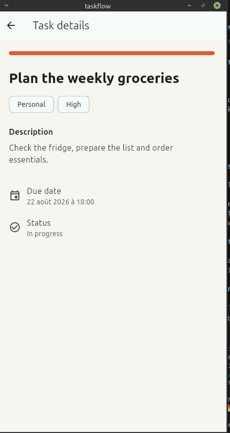
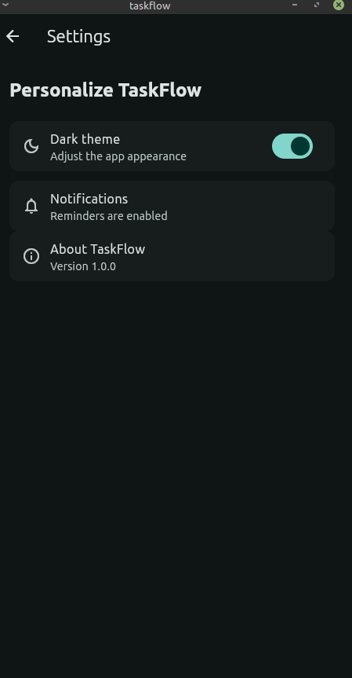

# TaskFlow

TaskFlow is a daily task manager built with Flutter. It helps users capture priorities, find tasks quickly and keep a simple view of what is next.

## Features

- Dashboard with data-driven open, completed and weekly task statistics
- Named-route navigation across Today, Tasks, Settings and New Task
- Search and category filtering on the task list
- Task detail screen with a passed `Task` parameter
- Validated form with title, description and category fields
- Light and dark themes
- Responsive dashboard layout with a 2-column mobile grid and 3-column tablet grid
- Reusable widgets in `lib/widgets/`
- UI/data separation in `lib/models/` and `lib/data/`

## Project structure

```text
lib/
  data/task_data.dart
  models/task.dart
  screens/
  widgets/
  main.dart
```

## Launch instructions

1. Install Flutter 3.19 or newer and verify it with `flutter doctor`.
2. From this folder, run `flutter pub get`.
3. Start an emulator or connect a device.
4. Run `flutter run`.
5. For a browser build, use `flutter run -d chrome`.

## Screenshots

### Today dashboard



### Filtered task list



### Task details



### Dark theme



## Certification checklist

| Requirement | Implementation |
| --- | --- |
| 4+ screens | Today dashboard, All tasks, Task details, New task and Settings |
| Navigation | Named routes in `lib/main.dart`, including `/detail` |
| Search/filter | Search field and category `ChoiceChip` filters in `TasksScreen` |
| Parameter passing | `Task` passed through `Navigator.pushNamed(..., arguments: task)` |
| Validated form | Title, description and category validators in `AddTaskScreen` |
| Theme support | Material 3 light/dark themes and Settings switch |
| Widget variety | `ListView`, `GridView`, `Stack`, `Card`, `Checkbox`, `ChoiceChip`, `Form`, `TextFormField` and more |
| Reusable widgets | `TaskCard`, `StatCard` and `EmptyState` in `lib/widgets/` |
| Responsive UI | `LayoutBuilder` changes the dashboard grid for tablet widths |
| Data separation | Tasks, categories and dashboard calculations live outside screen widgets |
